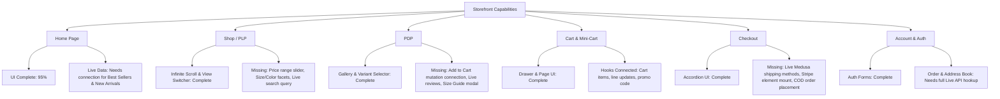

# EZ Commerce — Comprehensive Feature Architecture & Roadmap Tasklist

> **Document Version**: 2.0.0  
> **Target Stack**: Medusa v2 (`@medusajs/medusa` 2.x) Backend + Next.js 16 App Router Storefront + PostgreSQL + Redis  
> **Brand Direction**: High-contrast, bold Black-and-White aesthetic, pill-shaped UI (`rounded-full` buttons), performance-first DTC architecture.

---

## Table of Contents

1. [Executive Overview & Platform Philosophy](#1-executive-overview--platform-philosophy)
2. [Medusa v2 Capabilities Matrix: Built-in Modules vs. Custom Extensions](#2-medusa-v2-capabilities-matrix-built-in-modules-vs-custom-extensions)
3. [Current Storefront Audit & Gap Analysis](#3-current-storefront-audit--gap-analysis)
4. [Phase 1: Initial MVP Feature Task List (Must-Haves for Launch)](#4-phase-1-initial-mvp-feature-task-list-must-haves-for-launch)
   - [Epic 1: Dynamic Catalog & Homepage Integration](#epic-1-dynamic-catalog--homepage-integration)
   - [Epic 2: Shop & Discovery Experience (PLP)](#epic-2-shop--discovery-experience-plp)
   - [Epic 3: High-Converting Product Detail Page (PDP)](#epic-3-high-converting-product-detail-page-pdp)
   - [Epic 4: Cart & Slide-Over Drawer Experience](#epic-4-cart--slide-over-drawer-experience)
   - [Epic 5: End-to-End Multi-Step Checkout & Payments](#epic-5-end-to-end-multi-step-checkout--payments)
   - [Epic 6: Customer Authentication & Account Portal](#epic-6-customer-authentication--account-portal)
   - [Epic 7: Multi-Region, Multi-Currency & Localization](#epic-7-multi-region-multi-currency--localization)
   - [Epic 8: Performance, SEO, Security & Mobile Polish](#epic-8-performance-seo-security--mobile-polish)
5. [Phase 2: Post-MVP & Growth Features (Next Iterations)](#5-phase-2-post-mvp--growth-features-next-iterations)
   - [Epic 9: Product Reviews & Star Rating System](#epic-9-product-reviews--star-rating-system)
   - [Epic 10: Persistent Customer Wishlist](#epic-10-persistent-customer-wishlist)
   - [Epic 11: Apparel & Jersey Customization (Name, Number & Badges)](#epic-11-apparel--jersey-customization-name-number--badges)
   - [Epic 12: Instant Typeahead & Algolia/MeiliSearch Integration](#epic-12-instant-typeahead--algoliameilisearch-integration)
   - [Epic 13: Marketing Automations & Abandoned Cart Recovery](#epic-13-marketing-automations--abandoned-cart-recovery)
   - [Epic 14: Automated Self-Service Returns & RMA Portal](#epic-14-automated-self-service-returns--rma-portal)
   - [Epic 15: Loyalty Rewards, Tiered VIP & Referral Program](#epic-15-loyalty-rewards-tiered-vip--referral-program)
6. [Phase 3: Competitive Benchmark & Advanced DTC Features](#6-phase-3-competitive-benchmark--advanced-dtc-features)
7. [Technical Guidelines & Engineering Principles](#7-technical-guidelines--engineering-principles)

---

## 1. Executive Overview & Platform Philosophy

**EZ Commerce** is designed as a direct-to-consumer (DTC) e-commerce platform built on a headless, composable architecture. Starting with sports apparel and jerseys, the architecture is engineered to scale into any physical goods vertical without requiring a frontend or database redesign.

### Key Pillars
- **Framework-First Backend**: Powered by Medusa v2's modular framework, decoupling domains into self-sufficient units connected via Module Links and resilient Workflows.
- **Modern Next.js 16 Storefront**: Server Components, React 19, Tailwind CSS v4, dynamic URL state (`nuqs`), and TanStack Query for optimal client-side mutations.
- **Brand Consistency**: Monochromatic black-and-white visual identity, bold typography, generous whitespace, and strict pill-shaped (`rounded-full`) button components.

---

## 2. Medusa v2 Capabilities Matrix: Built-in Modules vs. Custom Extensions

Medusa v2 provides a comprehensive suite of official commerce modules out of the box. However, modern DTC e-commerce requires specialized modules that must be built as custom Medusa modules or third-party plugins.

### Official Built-in Medusa v2 Modules

| Module | Core Functionality Provided Out-of-the-Box | Storefront Endpoint / Usage |
| :--- | :--- | :--- |
| **Product Module** | Products, Variants, Options (Size, Color), Categories, Collections, Tags, Images | `/store/products`, `/store/product-categories`, `/store/collections` |
| **Pricing Module** | Currency-specific pricing, Price Lists, Sale/Discount pricing, Tax-inclusive prices | Included in product variant `calculated_price` fields |
| **Cart Module** | Cart creation, line item management, email assignment, shipping/billing addresses | `/store/carts`, `/store/carts/{id}/line-items` |
| **Order Module** | Order creation, item snapshots, order status, fulfillment tracking, order transfer | `/store/orders`, `/store/orders/{id}` |
| **Customer Module** | Customer profiles, saved addresses (billing/shipping), customer groups | `/store/customers/me`, `/store/customers/me/addresses` |
| **Auth Module** | Authentication sessions, JWT tokens, Email/Password, Social Auth integration | `/auth/customer/emailpass`, `/auth/session` |
| **Promotion Module** | Campaign promotions, standard discount codes (Percentage, Fixed Amount), Buy-X-Get-Y | `/store/carts/{id}/promotions` |
| **Inventory & Stock Location**| Multi-warehouse inventory tracking, variant reservations, stock availability check | Evaluated during variant addition and checkout |
| **Fulfillment Module** | Shipping options calculation, fulfillment providers, shipment tracking numbers | `/store/shipping-options`, `/store/carts/{id}/shipping-methods` |
| **Payment Module** | Payment collections, payment sessions, Stripe & Manual (Cash on Delivery) integration | `/store/payment-collections`, `/store/payment-providers` |
| **Tax Module** | Region/country specific tax rates, tax lines calculation per item/shipping | Calculated automatically on cart/order totals |
| **File Module** | S3 / MinIO / Local storage provider for product assets & customer uploads | Admin / Store file uploads |
| **Notification Module** | Event-driven notifications (Order Placed, Shipped, Password Reset) | Pub/Sub event subscribers (SendGrid, Resend) |

---

### Custom Modules & Extensions Required

| Feature Domain | Why Custom? (Medusa v2 Gap) | Backend Implementation Required | Storefront Implementation Required |
| :--- | :--- | :--- | :--- |
| **Product Reviews & Ratings** | Medusa v2 has no built-in reviews module. | Custom `reviews` module + data model (`rating`, `comment`, `images`, `verified_buyer`) + Link to `Product` & `Customer` + Moderation Workflow. | PDP Reviews list, Star rating summary, review submission form with image uploads, verified buyer badge. |
| **Persistent Customer Wishlist** | Medusa core does not store customer favorite items. | Custom `wishlist` module with Link to `Customer` and `ProductVariant`/`Product` + CRUD workflows. | LocalStorage sync for guest shoppers + API sync on login, heart toggle on product cards & PDP, dedicated `/wishlist` route. |
| **Apparel / Jersey Customization** | Dynamic text/number printing (e.g., Player Name #10) & sleeve badge attachments. | Cart line item `metadata` pass-through or custom `customization` module linking to order line items. | Interactive PDP visualizer/input fields for custom name, squad number, and league/cup badges. |
| **Back in Stock Alerts** | Automatic subscriber notification when out-of-stock variants are replenished. | Custom `stock_alerts` module + event subscriber listening to `inventory_level.updated`. | "Notify Me When Available" button on out-of-stock variants + modal collecting email address. |
| **Loyalty & Rewards Program** | Medusa does not have a native points/rewards ledger. | Custom `loyalty` module tracking point balances, earn rates per order, and discount redemption workflows. | Account points widget, checkout point redemption slider, VIP tier badges. |
| **Self-Service Returns / RMA** | While Medusa has Order Return entities, a customer-facing return initiation workflow is needed. | Store API route for return requests (`/store/orders/{id}/returns`) + Return Request workflow + notification. | Order detail page "Request Return" button, reason selector, item condition check, return label download. |
| **Advanced Instant Search** | Built-in DB search lacks typo-tolerance, facets, and instant indexing. | `@medusajs/medusa-plugin-meilisearch` or custom Algolia sync subscriber. | Header search modal with live typeahead, search query highlighting, popular searches, category suggestions. |

---

## 3. Current Storefront Audit & Gap Analysis



### Component Status Breakdown

| Feature / Page | Current Status | Implemented Components | Missing / Gaps to MVP |
| :--- | :--- | :--- | :--- |
| **Home Page (`/`)** | 🟢 UI Complete / 🟡 Mock Data | Hero, ValueProps, CategoryStrip, FeatureBanner, EditorialTiles, FAQ, Newsletter, Footer | Replace static `products.data.ts` with live Medusa query for Best Sellers and New Arrivals collections. |
| **Shop Page (`/shop`)** | 🟢 Mostly Connected | `useProducts` infinite query, `useCategories`, Nuqs URL state, Grid switch (2/3/4), Client sort | Add price range filter slider, size/color variant facet filters, backend search query string synchronization. |
| **Product Detail (`/shop/[id]`)** | 🟡 Partial Integration | `retrieveProduct` server fetch, `ProductGallery`, dynamic option selectors, live pricing | Connect "Add to Cart" button to `useAddToCart` mutation, add live reviews section, size guide modal. |
| **Cart Drawer & Page (`/cart`)** | 🟢 Fully Connected | `useCart`, `useUpdateLineItem`, `useDeleteLineItem`, `useApplyPromotion`, shipping progress bar | Test edge cases with multi-currency cart conversions and out-of-stock line item notifications. |
| **Checkout (`/checkout`)** | 🟡 UI Complete / Mock Flow | 4-step accordion, Zod shipping address validation form, Order summary | Connect Step 2 (Shipping Options), Step 3 (Stripe / COD payment sessions), Step 4 (Order placement & redirect to confirmation). |
| **Authentication (`/login`, `/register`)**| 🟢 Connected | Zod validation, Medusa customer login/register server actions, session cookie storage | Forgot password token submission, email verification feedback loop. |
| **Account (`/account/*`)** | 🟡 UI Complete / Mock Data | Profile overview, Order history table, Address management, Avatar upload | Connect `listOrders` to live customer orders, wire address create/edit/delete mutations. |
| **Wishlist (`/wishlist`)** | 🟡 UI Prototype | Responsive grid, empty state UI | Implement client-side storage or custom Medusa wishlist sync. |

---

## 4. Phase 1: Initial MVP Feature Task List (Must-Haves for Launch)

Below is the definitive, prioritized task list required to achieve a production-ready Minimum Viable Product (MVP).

---

### Epic 1: Dynamic Catalog & Homepage Integration
**Objective**: Ensure the homepage is 100% data-driven and reflects live inventory and categories from the Medusa backend.

- [ ] **Task 1.1: Replace Static Products on Homepage with Live Collections**
  - **Description**: Fetch live products for "Trending / Best Sellers" and "New Arrivals" using `sdk.store.product.list()` or `@lib/data/products.ts` with collection/tag filters.
  - **Acceptance Criteria**:
    - Homepage product grids display real titles, calculated prices, and thumbnail images from PostgreSQL.
    - Fallback skeleton loading states render smoothly during server component loading.
  - **Files**: `apps/storefront/src/app/[countryCode]/page.tsx`, `apps/storefront/src/feature/home/ProductGrid.tsx`.

- [ ] **Task 1.2: Dynamic Category Strip & Navigation Bar**
  - **Description**: Connect header navigation and homepage category strips to dynamic categories fetched via `useCategories()`.
  - **Acceptance Criteria**:
    - Clicking any category navigates to `/[countryCode]/shop?category=[category_id]`.
    - Active category reflects in header and sidebar states.

---

### Epic 2: Shop & Discovery Experience (PLP)
**Objective**: Enable effortless product discovery with comprehensive filtering, sorting, and fast pagination.

- [ ] **Task 2.1: Faceted Filter Panel (Category, Price, Size, In-Stock)**
  - **Description**: Expand `ShopSidebar.tsx` to include:
    - Dynamic Category checklist with product counts.
    - Price range dual slider (min/max price synchronized in URL query via `nuqs`).
    - Variant Size selector (e.g., S, M, L, XL, XXL).
    - "In Stock Only" toggle switch.
  - **Acceptance Criteria**:
    - Applying filters updates URL query params without full page reloads.
    - Filtering correctly combines parameters (`?category=xyz&min_price=20&max_price=100&size=M`).
  - **Files**: `apps/storefront/src/feature/shop/ShopSidebar.tsx`, `apps/storefront/src/feature/shop/ShopContent.tsx`.

- [ ] **Task 2.2: Global Search Bar Integration**
  - **Description**: Connect the search input in `Header.tsx` to the shop catalog.
  - **Acceptance Criteria**:
    - Submitting or typing with debounce updates `?q=[search_term]`.
    - Products matching title, description, or tags are displayed.
    - "No products found" empty state with clear search button and recommended categories.
  - **Files**: `apps/storefront/src/feature/home/Header.tsx`, `apps/storefront/src/lib/hooks/api/use-products.ts`.

---

### Epic 3: High-Converting Product Detail Page (PDP)
**Objective**: Build a high-converting, informative product page with accurate variant pricing, real-time inventory checks, and instant cart mutations.

- [ ] **Task 3.1: Wire "Add to Cart" Mutation with Quantity & Selected Variant**
  - **Description**: Hook up the "Add to Cart" button in `ProductInfo.tsx` to the Medusa cart SDK (`useAddToCart` / `addToCart`).
  - **Acceptance Criteria**:
    - Button triggers mutation with `variant_id` and `quantity`.
    - Loading spinner displays on the button while mutation is pending (`isPending`).
    - On success, the mini-cart drawer automatically slides open with the updated cart state.
    - User receives a toast error message if variant is out of stock.
  - **Files**: `apps/storefront/src/feature/shop/ProductInfo.tsx`, `apps/storefront/src/lib/hooks/api/use-cart.ts`.

- [ ] **Task 3.2: Variant Stock Level & Inventory Status Indicator**
  - **Description**: Display dynamic inventory status per selected variant:
    - *In Stock* (green badge).
    - *Low Stock Alert*: "Only X items left in stock" if inventory is below 5.
    - *Out of Stock*: Disable "Add to Cart" button, show "Sold Out" state.
  - **Acceptance Criteria**:
    - Changing variant options (e.g. from Size M to Size XL) updates stock availability in real time.

- [ ] **Task 3.3: Interactive Size Guide Modal**
  - **Description**: Build a responsive modal or slide-over drawer triggered by the "Size guide" link.
  - **Acceptance Criteria**:
    - Detailed measurement chart (Chest, Waist, Length in CM and Inches).
    - Visual guide on how to measure jerseys and sportswear.
  - **Files**: `apps/storefront/src/feature/shop/ProductInfo.tsx`, `apps/storefront/src/feature/shop/size-guide-modal.tsx`.

---

### Epic 4: Cart & Slide-Over Drawer Experience
**Objective**: Provide a frictionless cart management experience with real-time totals, discount codes, and free shipping nudges.

- [ ] **Task 4.1: Slide-Over Cart Drawer Polish**
  - **Description**: Ensure `ShowCarts.tsx` allows modifying quantities, removing items, viewing line-item totals, and deep linking directly to checkout.
  - **Acceptance Criteria**:
    - Optimistic updates or clear loading spinners during line item increments/decrements.
    - Currency formatted accurately based on active cart region without dividing by 100.
    - "Checkout Now" button links to `/[countryCode]/checkout`.
  - **Files**: `apps/storefront/src/feature/home/show-carts.tsx`.

- [ ] **Task 4.2: Coupon & Promotion Code Support in Cart**
  - **Description**: Enable applying Medusa promotion codes via `useApplyPromotion` and deleting applied promotion codes.
  - **Acceptance Criteria**:
    - Error message rendered clearly on invalid or expired promo codes.
    - Successfully applied discounts display discount name, amount deducted, and update cart total immediately.
  - **Files**: `apps/storefront/src/app/[countryCode]/(main)/cart/page.tsx`.

---

### Epic 5: End-to-End Multi-Step Checkout & Payments
**Objective**: Deliver a rock-solid, multi-step checkout supporting address capture, shipping calculation, Stripe card payments, and Cash on Delivery (COD).

- [ ] **Task 5.1: Checkout Step 1 — Customer & Address Capture**
  - **Description**: Connect shipping address form submission to Medusa `setAddresses` server action / `sdk.store.cart.update()`.
  - **Acceptance Criteria**:
    - Updates cart with customer email, shipping address, and billing address.
    - Automatically advances to Step 2 (Delivery Method) upon valid submission.
  - **Files**: `apps/storefront/src/app/[countryCode]/(checkout)/checkout/page.tsx`.

- [ ] **Task 5.2: Checkout Step 2 — Live Shipping Method Selection**
  - **Description**: Fetch available shipping options for the cart's region using `listCartShippingMethods(cart.id)` and allow user selection.
  - **Acceptance Criteria**:
    - Displays shipping provider name, estimated transit time, and price.
    - Selecting an option executes `setShippingMethod(shippingOptionId)` and recalculates cart totals immediately.
    - Advances to Step 3 (Payment Method).

- [ ] **Task 5.3: Checkout Step 3 — Payment Provider Integration (Stripe + Cash on Delivery)**
  - **Description**: Fetch active payment providers via `listCartPaymentMethods(regionId)`.
    - **Stripe**: Initialize Payment Session and mount Stripe Elements (`@stripe/react-stripe-js`).
    - **Cash on Delivery (Manual)**: Allow selecting Manual payment provider for pay-on-arrival orders.
  - **Acceptance Criteria**:
    - User can seamlessly enter card details or choose COD.
    - Authorizes or sets payment session on cart.

- [ ] **Task 5.4: Checkout Step 4 — Place Order & Order Confirmation Page**
  - **Description**: Complete the cart via `completeCart(cart.id)` and redirect to `/[countryCode]/order/confirmed/[id]`.
  - **Acceptance Criteria**:
    - Cart transitions into a confirmed Order.
    - Confirmation page displays Order ID, summary of items, shipping address, payment status, and tracking info.
    - Cart cookie is cleared to prevent reuse.
  - **Files**: `apps/storefront/src/app/[countryCode]/(checkout)/checkout/page.tsx`, `apps/storefront/src/app/[countryCode]/order/confirmed/[id]/page.tsx`.

---

### Epic 6: Customer Authentication & Account Portal
**Objective**: Enable customer login, registration, order history lookup, and address book management.

- [ ] **Task 6.1: Live Authentication Flows & Session Persistence**
  - **Description**: Ensure customer login and register forms authenticate via Medusa Auth (`@lib/data/customer.ts`) and maintain JWT cookies.
  - **Acceptance Criteria**:
    - Successful login redirects to customer dashboard or preserves redirect intent.
    - Unauthenticated access to `/account` routes redirects to `/login`.
    - Header displays customer initial/avatar when logged in.

- [ ] **Task 6.2: Live Customer Order History & Order Details**
  - **Description**: Replace `mockOrders` with live `listOrders()` call in `account/orders/page.tsx`.
  - **Acceptance Criteria**:
    - Lists all previous orders with date, payment status, fulfillment status, and order total.
    - Clicking an order navigates to `account/orders/details/[id]` with full itemized breakdown and tracking details.
  - **Files**: `apps/storefront/src/app/[countryCode]/(main)/account/orders/page.tsx`.

- [ ] **Task 6.3: Saved Addresses Management (CRUD)**
  - **Description**: Implement Add, Edit, Set as Default, and Delete actions for customer shipping addresses.
  - **Acceptance Criteria**:
    - Uses Medusa customer address endpoints (`/store/customers/me/addresses`).
    - Saved addresses automatically populate the checkout address selector.
  - **Files**: `apps/storefront/src/app/[countryCode]/(main)/account/addresses/page.tsx`.

---

### Epic 7: Multi-Region, Multi-Currency & Localization
**Objective**: Seamless global commerce with automatic country detection, correct currency symbols, and localized tax calculations.

- [ ] **Task 7.1: Country / Region Switcher Component**
  - **Description**: Build an accessible modal/dropdown in the header and footer allowing shoppers to switch target countries/regions.
  - **Acceptance Criteria**:
    - Switching country navigates to `/[newCountryCode]/...` and updates active cart region.
    - Prices recalculate accurately based on the new region's currency and tax settings.
  - **Files**: `apps/storefront/src/feature/home/Header.tsx`, `apps/storefront/src/feature/home/Footer.tsx`.

---

### Epic 8: Performance, SEO, Security & Mobile Polish
**Objective**: Ensure blazing-fast load times, flawless mobile responsiveness, and high search engine visibility.

- [ ] **Task 8.1: Metadata & OpenGraph Tags**
  - **Description**: Add dynamic `generateMetadata` for all product and collection pages with titles, descriptions, canonical URLs, and OpenGraph product preview images.
- [ ] **Task 8.2: Mobile Navigation & Bottom Bar Polish**
  - **Description**: Refine mobile hamburger menu drawer, touch-friendly filter sheets, and sticky "Add to Cart" mobile bar on PDP.
- [ ] **Task 8.3: Brand UI Verification**
  - **Description**: Audit all buttons and interactive controls across all pages to guarantee strict adherence to `rounded-full` (pill-shape) brand guidelines.

---

## 5. Phase 2: Post-MVP & Growth Features (Next Iterations)

Following the MVP launch, the following strategic features should be rolled out in scheduled sprints to boost average order value (AOV), conversion rates, and retention.

---

### Epic 9: Product Reviews & Star Rating System
*Competitor Parity: Shopify Yotpo / Judge.me / Nike*

- [ ] **Task 9.1: Medusa Backend Reviews Module**
  - **Data Model**: `Review` (`id`, `product_id`, `customer_id`, `rating` [1-5], `title`, `content`, `status` [pending, approved, rejected], `is_verified_buyer`, `images` [JSON]).
  - **Link**: Link `Review` to `Product` and `Customer`.
  - **Workflows**: `createReviewWorkflow`, `moderateReviewWorkflow`.
  - **API Routes**:
    - `GET /store/products/{id}/reviews` (Public list of approved reviews & aggregate score).
    - `POST /store/products/{id}/reviews` (Authenticated customer submission).
    - `GET /admin/reviews`, `POST /admin/reviews/{id}/status` (Admin moderation).
- [ ] **Task 9.2: Storefront PDP Reviews Section**
  - Rating breakdown bar chart (e.g. 85% 5-star, 10% 4-star).
  - Customer review submission modal with star picker and photo upload.
  - "Verified Buyer" badge for customers who purchased the product.
  - Helpful vote counter ("Was this review helpful?").

---

### Epic 10: Persistent Customer Wishlist
*Competitor Parity: ASOS / Zara / Gymshark*

- [ ] **Task 10.1: Backend Wishlist Module or Metadata Sync**
  - Custom `wishlist` module or Customer link storing array of `product_id` / `variant_id`.
  - Endpoint `GET /store/customers/me/wishlist`, `POST /store/customers/me/wishlist`, `DELETE /store/customers/me/wishlist/{id}`.
- [ ] **Task 10.2: Storefront Unified Wishlist Context**
  - Guest shoppers: Store item IDs in browser `localStorage`.
  - Authenticated shoppers: Automatically sync local items with customer account on login.
  - Heart icon toggle on Product Cards, PDP, and quick-add to cart directly from `/wishlist`.

---

### Epic 11: Apparel & Jersey Customization (Name, Number & Badges)
*Competitor Parity: Classic Football Shirts / Kitbag / Pro:Direct Soccer*

- [ ] **Task 11.1: Line Item Customization Schema**
  - Pass custom name, squad number, and selected competition sleeve badges into line item `metadata`.
  - Example metadata: `{ player_name: "BELLINGHAM", squad_number: "5", badge: "UCL_STARBALL", print_fee: 15.00 }`.
- [ ] **Task 11.2: Interactive Live Preview on PDP**
  - Live canvas / SVG jersey font preview showing customer's custom name and number on the jersey back.
  - Add optional printing fee to calculated line item price.
  - Customization summary displayed in Cart drawer, Checkout review, and Order confirmation.

---

### Epic 12: Instant Typeahead & Algolia/MeiliSearch Integration
*Competitor Parity: Lululemon / Nike / StockX*

- [ ] **Task 12.1: MeiliSearch / Algolia Search Engine Plugin**
  - Real-time product indexing subscriber on Medusa backend listening to `product.created`, `product.updated`.
- [ ] **Task 12.2: Storefront Search Modal Overlay**
  - Cmd+K / search icon opens interactive search dialog.
  - Instant typeahead results with thumbnails, price, and category matches.
  - "Popular Searches" tags and "Recently Searched" history stored locally.

---

### Epic 13: Marketing Automations & Abandoned Cart Recovery
*Competitor Parity: Klaviyo / Omnisend*

- [ ] **Task 13.1: Medusa Event Subscribers & Email Templates**
  - Automated transactional emails using Resend / SendGrid:
    - *Order Confirmation & Receipt*.
    - *Shipping Notification with Tracking URL*.
    - *Abandoned Cart Email*: Scheduled cron job sending cart recovery link with 1-click checkout restoration after 2 hours of inactivity.
- [ ] **Task 13.2: Newsletter Discount Trigger**
  - Subscribing to newsletter via homepage/footer generates unique 10% discount promo code sent via email.

---

### Epic 14: Automated Self-Service Returns & RMA Portal
*Competitor Parity: Loop Returns / Returnly*

- [ ] **Task 14.1: Customer Return Request API & Workflow**
  - Backend API endpoint `/store/orders/{id}/return-request`.
  - Return workflow creating return entity and notifying warehouse staff.
- [ ] **Task 14.2: Storefront Account Return Wizard**
  - Order details page contains "Start a Return" button within eligible return window (e.g. 30 days).
  - Step-by-step reason selector (Too small, defective, wrong item received).
  - Automated prepaid return shipping label generation.

---

### Epic 15: Loyalty Rewards, Tiered VIP & Referral Program
*Competitor Parity: Gymshark VIP / Nike Member Rewards*

- [ ] **Task 15.1: Backend Loyalty Module**
  - Track customer points ledger ($1 spent = 10 points).
  - Redemption rule: 100 points = $1 discount.
- [ ] **Task 15.2: Checkout Point Slider & Tier Badges**
  - Member tiers (Bronze, Silver, Gold, Platinum) with perks (Free Express Shipping, Early Access to Drops).
  - Checkout slider allowing members to apply earned points towards instantaneous cart discount.

---

## 6. Phase 3: Competitive Benchmark & Advanced DTC Features

To surpass top competitors in the DTC sportswear and apparel industry, the following advanced features are cataloged for future scale:

```
┌─────────────────────────────────────────────────────────────────────────────────────────┐
│                           COMPETITIVE DTC CAPABILITY MATRIX                             │
├───────────────────────────────┬──────────────┬───────────────┬──────────────────────────┤
│ Feature Capability            │ Shopify DTC  │ Classic Kits  │ EZ Commerce Plan         │
├───────────────────────────────┼──────────────┼───────────────┼──────────────────────────┤
│ 1-Click Express Checkout      │ Shop Pay     │ PayPal Express│ Stripe Link & Apple Pay  │
│ Live Social Proof / Tickers   │ App plugins  │ Custom        │ Built-in viewer counter  │
│ Complete the Look Cross-sells │ App plugins  │ Manual        │ Dynamic Bundle Engine    │
│ Augmented Reality (AR) Model  │ Shopify AR   │ None          │ 3D Model GLTF Viewer     │
│ Back in Stock SMS Alerts      │ Klaviyo      │ Email only    │ Twilio SMS + Resend Email│
│ Tiered VIP Wholesale Portal   │ Shopify Plus │ None          │ Customer Group Pricing   │
│ AI Storefront Concierge       │ Gorgias AI   │ Zendesk       │ Medusa Agent Chat Module │
└───────────────────────────────┴──────────────┴───────────────┴──────────────────────────┘
```

1. **Complete the Look / Dynamic Bundling Engine**:
   - Suggest matching shorts, socks, and training jackets on PDP with "Add Bundle to Cart" 1-click button (providing automatic 15% bundle discount).
2. **Stripe Link, Apple Pay & Google Pay 1-Click Checkout**:
   - Reduce checkout friction on mobile from 4 steps down to biometric fingerprint/face authentication.
3. **Internal Merchant AI Agent (Medusa Backend)**:
   - Admin assistant using Medusa's AI Agent framework to audit catalog, summarize top-selling products, and suggest restocking quantities based on sales velocity.
4. **Interactive 3D / AR Kit Viewer**:
   - 3D rotatable product model viewer for limited edition collector kits.

---

## 7. Technical Guidelines & Engineering Principles

### Medusa v2 Integration Rules
1. **Always Use Medusa JS SDK**:
   - Never use raw `fetch()` to `/store/*`. Always use `sdk.store.*` or `sdk.client.fetch()` for custom endpoints.
   - **Never use `JSON.stringify()`** in SDK request bodies. Pass plain JavaScript objects:
     ```typescript
     // ✅ CORRECT
     await sdk.client.fetch("/store/reviews", {
       method: "POST",
       body: { product_id: id, rating: 5 }
     });
     ```
2. **Exact Price Storage Rule**:
   - Medusa stores and calculates currency amounts in floating decimal form (e.g. `49.99` is stored as `49.99`, NOT in cents).
   - **Never multiply by 100 on input, and never divide by 100 on display**.
3. **Backend Workflow Rule**:
   - Every mutation in custom modules must be encapsulated in a Medusa Workflow (`createWorkflow` + `createStep`) with rollback compensation logic. Never execute mutations directly in API route handlers.

### Storefront UI & Styling Rules
1. **Pill-Shaped Buttons (Brand Mandate)**:
   - All buttons must use the `Button` primitive from `src/components/ui/button.tsx` styled with `rounded-full` (pill shape). Raw `<button>` tags with non-pill radiuses are strictly prohibited.
2. **Server Components First**:
   - Fetch initial data in Next.js Server Components. Delegate interactive sub-trees (forms, filters, drawers) to client components using `"use client"`.
3. **URL State Synchronization**:
   - Keep all filter, sort, search, and pagination states synchronized with the URL using `nuqs` to enable shareable, bookmarkable search results.

---

## 8. Summary of Immediate Action Items for MVP Launch

```
┌──────────────────────────────────────────────────────────────────────────────────────┐
│                              MVP SPRINT CHECKLIST                                    │
├─────┬──────────────────────────────────────────┬──────────────────────┬─────────────┤
│ Ref │ Action Item                              │ Primary Files        │ Priority    │
├─────┼──────────────────────────────────────────┼──────────────────────┼─────────────┤
│ 1.1 │ Connect Homepage Grids to Live Products  │ page.tsx, ProductGrid│ 🔴 CRITICAL │
│ 2.1 │ Finish Shop Price & Variant Filters      │ ShopSidebar.tsx      │ 🔴 CRITICAL │
│ 3.1 │ Connect PDP Add-to-Cart Mutation         │ ProductInfo.tsx      │ 🔴 CRITICAL │
│ 3.2 │ Variant Stock & Inventory Indicators     │ ProductInfo.tsx      │ 🔴 CRITICAL │
│ 5.1 │ Complete Checkout Step 1-4 Flow          │ checkout/page.tsx    │ 🔴 CRITICAL │
│ 5.3 │ Stripe Elements & COD Integration        │ checkout/page.tsx    │ 🔴 CRITICAL │
│ 5.4 │ Order Confirmation / Receipt Page        │ /order/confirmed/[id]│ 🔴 CRITICAL │
│ 6.2 │ Live Order History in Account Dashboard  │ account/orders/page  │ 🟡 HIGH     │
│ 6.3 │ Customer Address Book CRUD               │ account/addresses    │ 🟡 HIGH     │
│ 7.1 │ Country & Region Switcher Modal          │ Header.tsx, Footer   │ 🟡 HIGH     │
└─────┴──────────────────────────────────────────┴──────────────────────┴─────────────┘
```
