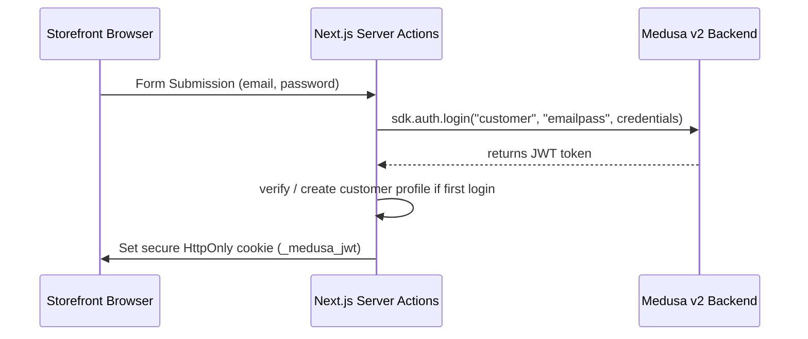
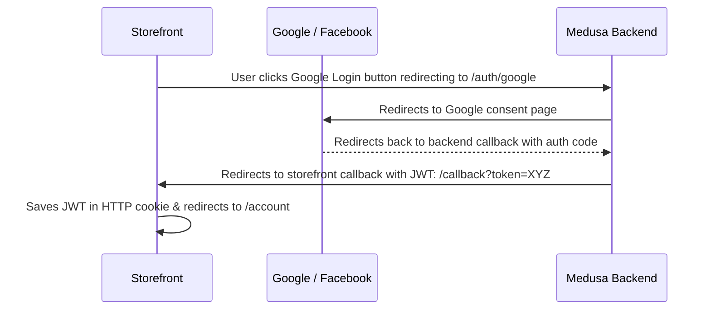

# Storefront Authentication Workflow (Medusa v2 + Next.js App Router)

This document outlines the authentication architecture and implementation strategy for the **ez-commerce storefront** integrating with a **Medusa v2** backend. It covers credentials-based registration/login, cookie-based session management, page & middleware route protection, and social login OAuth integration.

---

## 1. Overview & Architecture

Medusa v2 separates **Auth Identities** (which contain credentials or social provider links) from **Customer Profiles** (which contain name, email, addresses, and order history). This decoupling allows:
- A user to log in with different auth methods (email/password or social) under the same email.
- Safe association of customer records across guest and registered checkout.



---

## 2. Credentials-Based Signup & Login

The storefront uses Server Actions located in [customer.ts](file:///c:/yeasin2002/experiments/ez-commerce/apps/storefront/src/lib/data/customer.ts) to handle credentials-based authentication.

### Registration (Signup)
1. The user fills out the [register page](file:///c:/yeasin2002/experiments/ez-commerce/apps/storefront/src/app/[countryCode]/(auth)/register/page.tsx) form.
2. The form triggers the [signup](file:///c:/yeasin2002/experiments/ez-commerce/apps/storefront/src/lib/data/customer.ts#L87) server action.
3. The action runs `sdk.auth.register("customer", "emailpass", { email, password })` to register the auth identity.
4. Additional signup fields (name, phone) are temporarily stored using `setPendingCustomer` in cookies.
5. The function automatically proceeds to call `completeLogin`.

### Login
1. The user fills out the [login page](file:///c:/yeasin2002/experiments/ez-commerce/apps/storefront/src/app/[countryCode]/(auth)/login/page.tsx) form.
2. The form triggers the [login](file:///c:/yeasin2002/experiments/ez-commerce/apps/storefront/src/lib/data/customer.ts#L127) server action.
3. The action runs [completeLogin](file:///c:/yeasin2002/experiments/ez-commerce/apps/storefront/src/lib/data/customer.ts#L140):
   - Authenticates using `sdk.auth.login`.
   - Checks if a customer profile exists for the authenticated user via `sdk.store.customer.retrieve`.
   - If no profile exists (e.g., right after signup), it retrieves the pending details and creates the profile using `sdk.store.customer.create`.
   - Once successfully logged in, it stores the JWT via `setAuthToken(token)`.
   - Transfers any guest cart items to the customer account via `transferCart`.

---

## 3. Session Management

Storefront sessions are persisted on the client via secure cookies and attached automatically to backend SDK requests.

### Storage
Session details are managed in [cookies.ts](file:///c:/yeasin2002/experiments/ez-commerce/apps/storefront/src/lib/data/cookies.ts):
- **`_medusa_jwt`**: Stores the JWT token for the authenticated customer. Configured as `httpOnly: true`, `sameSite: "strict"`, and `secure: true` in production.
- **`_medusa_pending_customer`**: Temporarily stores user info during registration/verification flows.
- **`_medusa_cart_id`**: Stores the active cart ID to persist guest/customer carts across reloads.

### Attaching Session Headers
All authenticated API queries and mutations must include authorization headers. 
- [getAuthHeaders](file:///c:/yeasin2002/experiments/ez-commerce/apps/storefront/src/lib/data/cookies.ts#L4) reads the `_medusa_jwt` cookie and formats it: `Authorization: Bearer <token>`.
- This header is then spread into the options of any SDK call, e.g.:
  ```typescript
  const headers = await getAuthHeaders();
  const customer = await sdk.store.customer.retrieve({}, {}, headers);
  ```

### Logout
Triggered by the [signout](file:///c:/yeasin2002/experiments/ez-commerce/apps/storefront/src/lib/data/customer.ts#L250) server action:
1. Calls `sdk.auth.logout()` to invalidate the session on the backend.
2. Deletes storefront cookies (`_medusa_jwt`, `_medusa_cart_id`).
3. Revalidates next.js cached data tags (`customers`, `carts`).
4. Redirects the browser to the account/login route.

---

## 4. Route Protection

To safeguard private pages (such as `/account/*`) and restrict authenticated users from visiting guest-only pages (such as `/login` and `/register`), route protection is implemented at two levels:

### A. Next.js Middleware (Edge Redirects)
Integrate check logic in Next.js middleware by verifying the token directly before rendering:
```typescript
// middleware.ts
import { NextRequest, NextResponse } from "next/server"

export async function middleware(request: NextRequest) {
  const token = request.cookies.get("_medusa_jwt")?.value
  const countryCode = request.nextUrl.pathname.split("/")[1] || "us"
  const isAuthPage = request.nextUrl.pathname.includes("/login") || request.nextUrl.pathname.includes("/register")
  const isAccountPage = request.nextUrl.pathname.includes("/account")

  if (isAccountPage && !token) {
    return NextResponse.redirect(new URL(`/${countryCode}/login`, request.url))
  }
  
  if (isAuthPage && token) {
    return NextResponse.redirect(new URL(`/${countryCode}/account`, request.url))
  }
  
  return NextResponse.next()
}
```

### B. Server-Side Guard (Server Components)
To ensure the session token is actually valid (and not just present but expired), call [retrieveCustomer](file:///c:/yeasin2002/experiments/ez-commerce/apps/storefront/src/lib/data/customer.ts#L43) inside `app/[countryCode]/account/layout.tsx`. If it resolves to `null`, redirect to the login page:
```typescript
import { retrieveCustomer } from "@/lib/data/customer"
import { redirect } from "next/navigation"

export default async function AccountLayout({ params }: { params: { countryCode: string } }) {
  const customer = await retrieveCustomer()
  if (!customer) {
    redirect(`/${params.countryCode}/login`)
  }
  
  // Render Account UI
}
```

---

## 5. Social Authentication (Google & Facebook)

Social login is handled as a standard OAuth authorization flow redirecting between the Storefront browser, Google/Facebook, the Medusa backend, and back to the Storefront.

### Flow Step-by-Step



### Storefront UI Configuration
In [social-auth.tsx](file:///c:/yeasin2002/experiments/ez-commerce/apps/storefront/src/feature/auth/social-auth.tsx), replace client-side handlers with direct anchors pointing to the Medusa backend OAuth initiators:
```tsx
const BACKEND_URL = process.env.NEXT_PUBLIC_MEDUSA_BACKEND_URL;

// Google Button:
<a href={`${BACKEND_URL}/auth/google`} className="btn">Sign in with Google</a>

// Facebook Button:
<a href={`${BACKEND_URL}/auth/facebook`} className="btn">Sign in with Facebook</a>
```

### Storefront Callback Page
Create `app/[countryCode]/(auth)/callback/page.tsx` to process the authenticated token returned in query parameters:
```tsx
"use client"

import { use, useEffect } from "react"
import { useRouter, useSearchParams } from "next/navigation"
import { setAuthToken } from "@/lib/data/cookies"

export default function AuthCallbackPage({ params }: { params: Promise<{ countryCode: string }> }) {
  const { countryCode } = use(params)
  const router = useRouter()
  const searchParams = useSearchParams()
  const token = searchParams.get("token")

  useEffect(() => {
    if (token) {
      setAuthToken(token).then(() => {
        router.push(`/${countryCode}/account`)
      })
    } else {
      router.push(`/${countryCode}/login?error=oauth_failed`)
    }
  }, [token, countryCode, router])

  return (
    <div className="flex items-center justify-center min-h-[300px]">
      <p className="text-sm text-muted-foreground animate-pulse">Completing sign in...</p>
    </div>
  )
}
```
