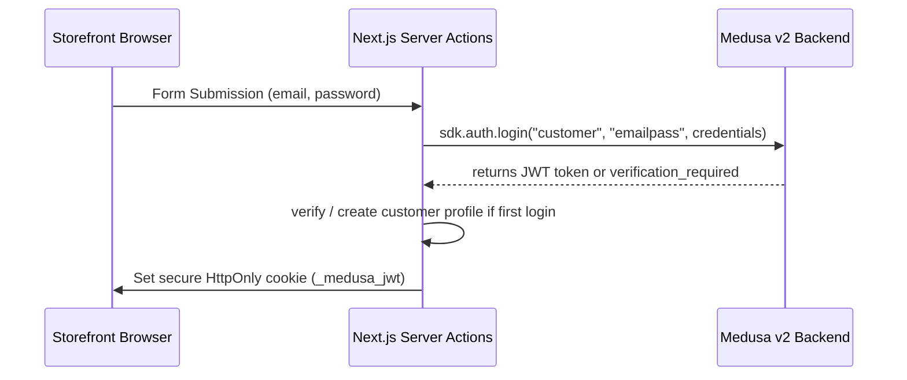

# Storefront Authentication Workflow (Medusa v2 + Next.js App Router)

This document outlines the authentication architecture and implementation strategy for the **EzCommerce Storefront** integrating with a **Medusa v2** backend (`@medusajs/js-sdk`).

---

## 1. Overview & Architecture

Medusa v2 separates **Auth Identities** (which contain credentials or provider links) from **Customer Profiles** (which contain names, email, addresses, and order history).


```mermaid
sequenceDiagram
    participant Browser as Storefront Browser
    participant Server as Next.js Server Actions
    participant Backend as Medusa v2 Backend
    
    Browser->>Server: Form Submission (email, password)
    Server->>Backend: sdk.auth.login("customer", "emailpass", credentials)
    Backend-->>Server: returns JWT token or verification_required
    Server->>Server: verify / create customer profile if first login
    Server->>Browser: Set secure HttpOnly cookie (_medusa_jwt)
```

---

## 2. Authentication Flows

### A. Customer Registration (`/register`)
1. Customer enters first name, last name, email, phone, and password.
2. Storefront calls `signup(null, formData)` in `src/lib/data/customer.ts`.
3. Action calls `sdk.auth.register("customer", "emailpass", { email, password })`.
4. Pending customer details (`first_name`, `last_name`, `phone`) are temporarily stored in `_medusa_pending_customer` cookie.
5. Action calls `completeLogin(email, password)`:
   - If backend requires verification (`verification_required: true`), requests verification code via `sdk.auth.verification.request` and redirects user to `/[countryCode]/otp?email=...`.
   - If verification is not required, retrieves or creates customer profile via `sdk.store.customer.create`, sets `_medusa_jwt` cookie, transfers guest cart items, and redirects to `/[countryCode]/account`.

### B. Customer Login (`/login`)
1. Customer enters email and password.
2. Storefront calls `login(null, formData)`.
3. Calls `sdk.auth.login("customer", "emailpass", { email, password })`.
4. If valid, stores session token in `_medusa_jwt`, reconciles customer profile, transfers active cart, and redirects to `/[countryCode]/account`.
5. If verification is required, redirects to `/[countryCode]/otp?email=...`.

### C. Password Reset Flow (`/forgot-password`)
1. **Request Reset Token**:
   - Customer submits their email on `/[countryCode]/forgot-password`.
   - Action calls `sdk.auth.resetPassword("customer", "emailpass", { identifier: email })`.
   - Medusa emits the `auth.password_reset` event with the generated reset token.
   - For local development, the token is logged to both backend and storefront terminal in highlighted ANSI colors.
2. **Submit New Password with Token**:
   - Customer enters the received reset token and their new password (min 6 characters).
   - Action calls `sdk.auth.updateProvider("customer", "emailpass", { password: newPassword }, token)`.
   - On success, customer is redirected to `/[countryCode]/login`.

### D. OTP & Email Verification (`/otp` & `/verify-email`)
1. Customer enters 6-digit OTP or verification code.
2. Storefront calls `confirmEmailVerification(code)`.
3. Action calls `sdk.auth.verification.confirm({ code })`.
4. Resend code triggers `resendVerificationCode(email)` which requests a fresh code/token.

---

## 3. Local Development Testing (Without Email Provider)

When testing locally without an active SMTP email provider (such as SendGrid or Resend):
- Medusa emits auth events (`auth.password_reset`, `auth.verification_requested`).
- The backend subscriber (`apps/backend/src/subscribers/auth-notifications.ts`) and storefront actions log generated tokens and OTPs directly to the terminal with vibrant ANSI colors:
  ```
  ⚡ [MEDUSA AUTH EVENT]
  Event Name: auth.password_reset
  Target Identity / Email: customer@example.com
  🔑 Auth / Reset Token:
  [token_string_here]
  ```
- Copy and paste the token directly into the storefront UI to verify or reset passwords during development.

---

## 4. Session & Cookie Management

- **`_medusa_jwt`**: Secure `httpOnly` cookie storing the authenticated JWT token.
- **`_medusa_pending_customer`**: Temporary cookie holding customer registration details during initial signup.
- **`_medusa_cart_id`**: Active cart ID cookie transferred to the authenticated customer account upon login.
- **`retrieveCustomer()`**: Validates active session via `sdk.client.fetch("/store/customers/me")`.

---

## 5. Route Protection & Guards

1. **Proxy / Middleware (`src/proxy.ts`)**:
   - Unauthenticated access to `/[countryCode]/account/*` redirects to `/[countryCode]/login`.
   - Authenticated access to `/[countryCode]/login` or `/[countryCode]/register` redirects to `/[countryCode]/account`.
2. **Server-side Layout Guard (`src/app/[countryCode]/(main)/account/layout.tsx`)**:
   - Fetches current customer with `retrieveCustomer()`.
   - Redirects to login if session token is invalid or expired.
